<p align="center">
  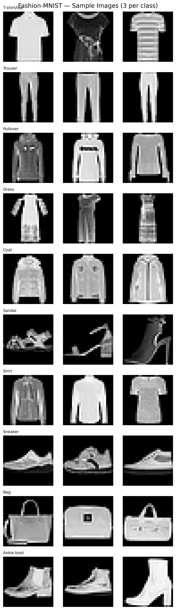
</p>

<h1 align="center">&#x1F9E5; L37 &mdash; Fashion-MNIST Deep Learning Architecture Study</h1>

<p align="center">
  <em>Classifying clothing images with 10 neural network architectures &mdash; a scientific experiment anyone can follow</em>
</p>

<p align="center">
  
  
  
  
  
</p>

<p align="center">
  <a href="https://colab.research.google.com/github/hadarwayn/L37-Fashion-MNIST-Classification-with-Keras-Deep-Learning-Architecture-Study/blob/main/notebooks/L37_Fashion_MNIST_Architecture_Study.ipynb">
    
  </a>
</p>

> **Run it now!** Click the badge above to open the full interactive notebook in Google Colab &mdash; no setup required. Select **Runtime &rarr; Change runtime type &rarr; T4 GPU** for 10-50x faster training.

---

## Abstract

This project is a controlled scientific study that trains, evaluates, and compares **10 distinct neural network architectures** on the Fashion-MNIST dataset &mdash; 70,000 grayscale images of clothing items across 10 categories. We progress from the simplest possible fully connected network to a mini-ResNet with skip connections, measuring how each architectural decision (depth, width, convolutions, dropout, batch normalization, residual paths) affects accuracy, training speed, and generalization. Every experiment uses identical data splits, hyperparameters, and evaluation procedures so that the **only variable is the architecture itself**. The result is a practical, visual, and educational reference for anyone learning deep learning.

---

## Table of Contents

| # | Section | What You Will Learn |
|---|---------|-------------------|
| 1 | [What Is This Project?](#what-is-this-project-for-complete-beginners) | The big picture in plain English |
| 2 | [The 10 Fashion Categories](#the-10-fashion-categories) | What the network is trying to classify |
| 3 | [Dataset Deep Dive](#dataset-deep-dive) | How we prepare 70,000 images for training |
| 4 | [What Is a Neural Network?](#what-is-a-neural-network-educational-foundation) | Neurons, layers, and the bakery analogy |
| 5 | [The 10 Architectures](#the-10-architectures--our-experiments) | Detailed model cards, results, and insights |
| 6 | [Loss Function Comparison](#loss-function-comparison) | How the network measures "wrongness" |
| 7 | [The Grand Comparison](#the-grand-comparison) | All 10 models head-to-head |
| 8 | [Hardware & Performance](#hardware--performance-report) | GPU info and training times |
| 9 | [Misclassified Examples](#misclassified-examples) | Where even the best model fails |
| 10 | [Key Takeaways](#what-i-learned--key-takeaways) | The 10 biggest lessons |
| 11 | [How to Run This Project](#how-to-run-this-project) | Colab, WSL, and PowerShell instructions |
| 12 | [Project Structure](#project-structure) | Directory tree and file descriptions |
| 13 | [Technologies & Tools](#technologies--tools) | Every package and its purpose |
| 14 | [Author & License](#author-license--acknowledgments) | Credits and license info |

---

## What Is This Project? (For Complete Beginners)

Imagine you work at a massive clothing warehouse. Every day, **thousands of items** arrive on a conveyor belt &mdash; T-shirts, trousers, sneakers, bags &mdash; and your job is to sort each item into the correct bin. You are fast, but you get tired. You make mistakes when a shirt looks like a pullover. And you definitely cannot sort 10,000 items per second.

**This project teaches a computer to do that job.**

We show a neural network 60,000 tiny pictures of clothing (each just 28 x 28 pixels, smaller than your thumbnail) and let it *learn* what makes a sneaker look different from an ankle boot. Then we test it on 10,000 images it has **never seen before** to see how well it learned.

But here is the twist: we do not build just one network. We build **ten different ones**, each with a different internal design, and we compare them scientifically. It is like testing 10 different sorting machines to find out which one is fastest and most accurate.

### The Journey in One Picture

```
                    +-----------------+
  28x28 pixel       |                 |      "This is a
  grayscale    ---> | Neural Network  | ---> Sneaker!"
  image             |   (10 types)    |      (with 92% confidence)
                    +-----------------+
```

Think of it this way:

| Step | What Happens | Real-World Analogy |
|------|--------------|--------------------|
| **Input** | A 28x28 grayscale image enters the network | You hold up a clothing item |
| **Processing** | Millions of tiny math operations extract patterns | Your brain recognizes the shape, texture, and style |
| **Output** | The network picks one of 10 categories | You toss it into the right bin |

> **Why Fashion-MNIST and not regular MNIST (handwritten digits)?** Digits are *too easy* &mdash; even simple models score above 97%. Clothing is harder because many items look similar (shirts vs. pullovers), making it a better benchmark for studying architecture differences.

---

## The 10 Fashion Categories

The Fashion-MNIST dataset contains exactly **10 categories** of clothing and accessories. Each image is a 28x28 pixel grayscale photograph centered on a single item against a plain background.


| Label | Class Name | Description | Difficulty |
|:-----:|------------|-------------|:----------:|
| 0 | T-shirt/top | Short-sleeved casual tops | Hard |
| 1 | Trouser | Long pants and jeans | Easy |
| 2 | Pullover | Long-sleeved pullovers, often with round neck | Hard |
| 3 | Dress | One-piece dresses of various lengths | Medium |
| 4 | Coat | Jackets and coats with buttons or zippers | Medium |
| 5 | Sandal | Open-toed summer shoes | Easy |
| 6 | Shirt | Collared shirts, button-ups | Hard |
| 7 | Sneaker | Athletic closed-toe shoes | Easy |
| 8 | Bag | Handbags, backpacks, tote bags | Easy |
| 9 | Ankle boot | Short boots covering the ankle | Easy |

### The "Shirt Problem" &mdash; Why This Dataset Is Interesting

Three categories &mdash; **T-shirt (0), Pullover (2), and Shirt (6)** &mdash; look extremely similar when reduced to 28x28 grayscale pixels. Imagine trying to tell apart a white T-shirt, a white pullover, and a white dress shirt when you can only see a tiny, blurry, black-and-white photo. This is the hardest challenge in the dataset, and it is where we will see the biggest differences between architectures.

```
  T-shirt (0)          Pullover (2)         Shirt (6)
  +-----------+        +-----------+        +-----------+
  |  /-----\  |        | /-------\ |        | /--| |--\ |
  | / short \ |        |/ long    \|        |/ collar  \|
  ||sleeves  ||        || sleeves  ||        || buttons  ||
  | \       / |        | \        / |        | \        / |
  |  -------  |        |  --------  |        |  --------  |
  +-----------+        +-----------+        +-----------+
     Easy to              Hard to              Hardest to
     recognize             tell apart           distinguish
```

> **The key difference:** Shirts have collars and buttons, pullovers have longer sleeves without front openings, and T-shirts have shorter sleeves. But at 28x28 pixels, these subtle distinctions blur together. This is exactly why we need *convolutional* neural networks &mdash; they can detect these local patterns.

---

## Dataset Deep Dive

### Where Does the Data Come From?

Fashion-MNIST was created by [Zalando Research](https://github.com/zalandoresearch/fashion-mnist) as a drop-in replacement for the classic MNIST handwritten digits dataset. It is built into TensorFlow/Keras, so loading it requires just one line of code.

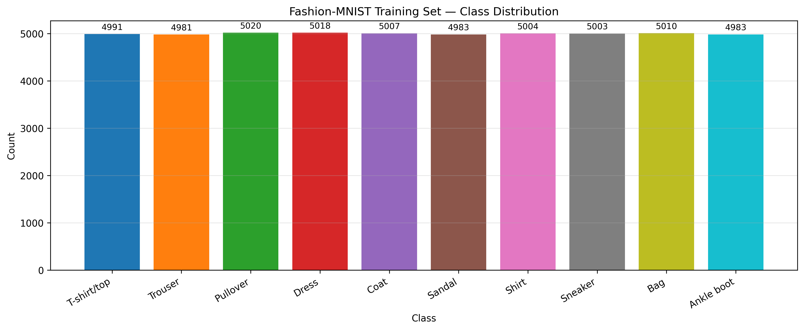

### Data Split: Train / Validation / Test

We split the original 70,000 images into three non-overlapping sets:

```
  Original Keras Dataset
  =======================
  60,000 training images ──┬── 50,000 Training Set (learn from these)
                           └── 10,000 Validation Set (tune hyperparameters)
  10,000 test images ─────── 10,000 Test Set (final grade — touched ONCE)
```

| Split | Size | Purpose | Analogy |
|-------|------|---------|---------|
| **Training** | 50,000 | The network learns patterns from these | Textbook chapters you study |
| **Validation** | 10,000 | Monitors for overfitting during training | Practice quizzes after each chapter |
| **Test** | 10,000 | Final, untouched evaluation | The final exam you only take once |

> **Why not use all 60K for training?** If a student only studies the textbook and never takes a practice quiz, they might just memorize the answers instead of understanding the material. The validation set catches this "memorization" (called *overfitting*) early.

### Normalization: Preparing the Pixels

Raw pixel values range from **0 to 255** (standard 8-bit grayscale). Neural networks work better with small numbers, so we divide every pixel by 255 to scale them into the range **0.0 to 1.0**.

| Stage | Pixel Range | Why |
|-------|-------------|-----|
| **Raw** | 0 &ndash; 255 | Original image encoding |
| **Normalized** | 0.0 &ndash; 1.0 | Faster convergence, numerical stability |

```
Before:  [0, 47, 128, 201, 255, ...]   (integers, large range)
After:   [0.0, 0.184, 0.502, 0.788, 1.0, ...]   (floats, 0-1 range)
```

Think of it like converting temperatures from Fahrenheit to Celsius &mdash; the information is the same, but the scale is easier to work with.

---

## What Is a Neural Network? (Educational Foundation)

### The Bakery Analogy

Imagine a bakery that takes raw ingredients (flour, sugar, eggs) and transforms them step by step into a finished cake. Each workstation in the bakery does one small job:

1. **Station 1** &mdash; Mix dry ingredients
2. **Station 2** &mdash; Add wet ingredients and blend
3. **Station 3** &mdash; Pour into pan and bake
4. **Station 4** &mdash; Decorate and label ("Chocolate Cake")

A neural network works the same way. Each **layer** is a workstation. Raw data (pixels) enters on one end, gets transformed step by step, and a label ("Sneaker") comes out the other end. The "recipe" (the numbers inside each layer, called *weights*) is learned automatically by showing the network thousands of examples.

### What Is a Neuron?

A single neuron does three things:

```
  Inputs (x1, x2, x3)      Weights (w1, w2, w3)
        \   |   /                 \   |   /
         \  |  /                   \  |  /
          [Multiply & Sum]    =    w1*x1 + w2*x2 + w3*x3 + bias
               |
          [Activation Function]    (e.g., ReLU: keep if positive, else 0)
               |
            Output
```

Think of each weight as a "volume knob" that controls how much attention the neuron pays to each input. During training, the network adjusts these knobs millions of times until it finds the right combination.

### Fully Connected (FC) vs. Convolutional (CNN)

This project tests both types. Here is the key difference:

```
  Fully Connected (FC) Layer          Convolutional (CNN) Layer
  ============================        ============================
  Every pixel connects to             A small sliding window (filter)
  every neuron:                       scans across the image:

  [p1]──┐                            [■ ■ ■]
  [p2]──┼──[n1]                      [■ ■ ■]  ← 3x3 filter slides
  [p3]──┤  [n2]                      [■ ■ ■]    across the image
  [p4]──┼──[n3]
  [p5]──┘                            Detects LOCAL patterns
                                     (edges, textures, shapes)
  Sees ALL pixels at once
  but has NO sense of position
```

| Feature | FC (Fully Connected) | CNN (Convolutional) |
|---------|---------------------|---------------------|
| **How it reads the image** | Flattens 28x28 into a 784-number list | Slides small filters across the 2D image |
| **Spatial awareness** | None &mdash; pixel 1 and pixel 784 are treated the same | High &mdash; nearby pixels are processed together |
| **Parameter count** | Very high (every pixel to every neuron) | Low (shared filter weights) |
| **Best for** | Tabular data, simple patterns | Images, spatial patterns |
| **Analogy** | Reading a book by looking at all letters at once | Reading a book word by word, left to right |

> **Why are CNNs better for images?** When you look at a photo, you do not see 784 individual pixels &mdash; you see *edges*, *textures*, and *shapes*. A CNN does the same thing: its filters detect edges first, then combine edges into shapes, then combine shapes into objects. An FC network has to learn all of this from scratch, with no built-in understanding of spatial relationships.

---

## The 10 Architectures &mdash; Our Experiments

We organize our 10 models into **4 groups**, each answering a different question:

| Group | Models | Research Question |
|-------|--------|-------------------|
| **A** &mdash; FC Baselines | 1, 2, 3 | How far can fully connected networks go? |
| **B** &mdash; CNN Exploration | 4, 5, 6, 7 | How does CNN depth and width affect accuracy? |
| **C** &mdash; Regularization | 8, 9 | Can dropout and batch norm improve the baseline CNN? |
| **D** &mdash; Advanced | 10 | Do skip connections (ResNet-style) help? |

---

### Group A: Fully Connected Baselines

> **Group Question:** *How well can networks without convolutions classify clothing images?*

These three models flatten each 28x28 image into a 784-number list and use only Dense layers. They serve as our **control group** &mdash; the baseline against which all CNN models will be judged.

---

#### Model 1: FC Baseline

| Property | Value |
|----------|-------|
| **Name** | FC Baseline |
| **Group** | A &mdash; Fully Connected Baselines |
| **Architecture** | Flatten &rarr; Dense(128, ReLU) &rarr; Dense(10, Softmax) |
| **Parameters** | 101,770 |
| **Epochs** | 20 |

**Why This Model?**
Every experiment needs a starting point. This is the simplest possible neural network that can classify Fashion-MNIST: one hidden layer with 128 neurons. It is our "control group" &mdash; the score to beat.

**Real-World Analogy:** Imagine a new employee on their first day at the clothing warehouse. They have a basic checklist ("Does it have sleeves? Is it long? Is it a shoe?") but no specialized training. They will get the obvious items right (trousers, bags) but struggle with the tricky ones (shirt vs. pullover).

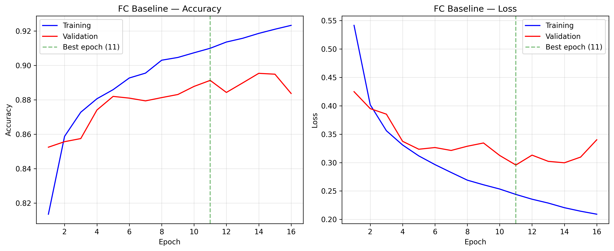

| Metric | Value |
|--------|-------|
| Test Accuracy | 88.13% |
| Test Loss | 0.3322 |
| Training Time | 77.9s |
| Best Epoch | 11 / 16 |


**The Verdict:** The FC Baseline establishes our floor. It proves that even the simplest network can learn *something* about clothing &mdash; but 88.13% means it is getting roughly 1 in 8 images wrong, mostly in the shirt/pullover/T-shirt confusion zone.

---

#### Model 2: Narrow Deep FC

| Property | Value |
|----------|-------|
| **Name** | Narrow Deep FC |
| **Group** | A &mdash; Fully Connected Baselines |
| **Architecture** | Flatten &rarr; Dense(64) &rarr; Dense(64) &rarr; Dense(64) &rarr; Dense(10) |
| **Parameters** | 59,210 |
| **Epochs** | 20 |

**Why This Model?**
What if we make the network *deeper* (more layers) but *narrower* (fewer neurons per layer)? This tests whether depth alone helps FC networks. Think of it as replacing one experienced worker with a chain of three less experienced workers &mdash; each one refines the work of the previous one.

**Real-World Analogy:** An assembly line with three stations: Station 1 checks the general shape, Station 2 checks for specific features (collar, sleeves), Station 3 makes the final call. Each station has a narrow view, but together they might be thorough.

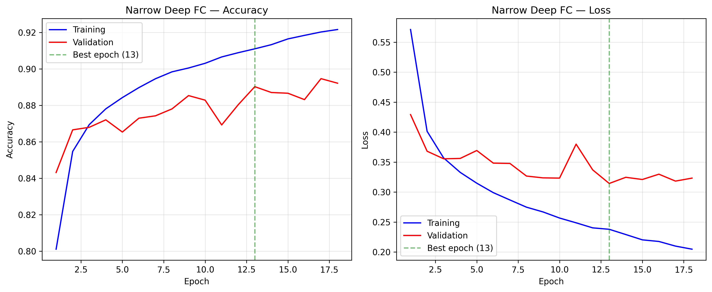

| Metric | Value |
|--------|-------|
| Test Accuracy | 88.40% |
| Test Loss | 0.3411 |
| Training Time | 65.9s |
| Best Epoch | 13 / 18 |

**The Verdict:** Despite having 3 hidden layers, the narrow FC network does **not** significantly outperform the single-layer baseline. This teaches us an important lesson: **depth without the right architecture (convolutions) has diminishing returns for image data**. The information bottleneck at 64 neurons actually *hurts* performance by forcing too much compression.

---

#### Model 3: Wide Shallow FC

| Property | Value |
|----------|-------|
| **Name** | Wide Shallow FC |
| **Group** | A &mdash; Fully Connected Baselines |
| **Architecture** | Flatten &rarr; Dense(512, ReLU) &rarr; Dense(10, Softmax) |
| **Parameters** | 407,050 |
| **Epochs** | 20 |

**Why This Model?**
The opposite experiment: instead of going deeper, we go *wider*. With 512 neurons in a single hidden layer (4x more than the baseline), the network has more capacity to memorize patterns. Does brute-force capacity make up for a lack of depth?

**Real-World Analogy:** Instead of a chain of specialists, imagine one worker with a *massive* desk covered in 512 reference photos. They compare each incoming item against all 512 references at once. They are thorough but slow, and they might memorize specific training items instead of learning general rules.

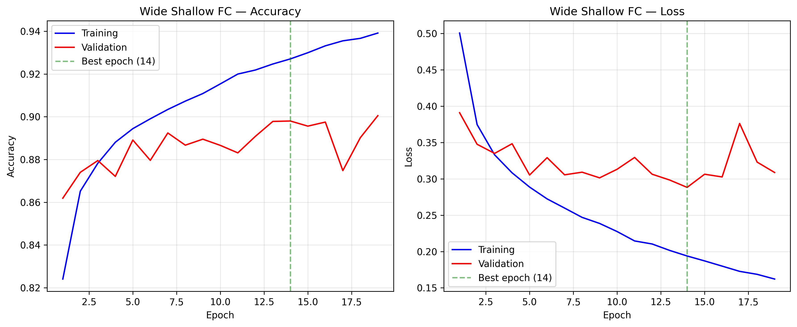

| Metric | Value |
|--------|-------|
| Test Accuracy | 88.93% |
| Test Loss | 0.3267 |
| Training Time | 129.1s |
| Best Epoch | 14 / 19 |

**The Verdict:** Width helps slightly, but we hit a clear ceiling. Even with 4x the parameters of the baseline, the wide FC network cannot break the ~89% barrier (topped out at 88.93%). This tells us that **the limiting factor is not capacity &mdash; it is the architecture itself**. FC networks fundamentally cannot exploit the spatial structure of images.

---

#### Group A Summary

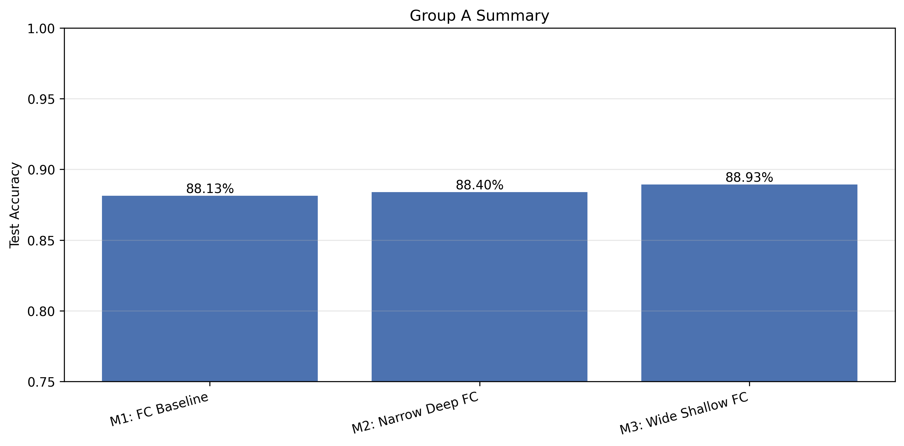

| Model | Params | Accuracy | Key Finding |
|-------|-------:|----------|-------------|
| FC Baseline | 101,770 | 88.13% | Establishes the floor |
| Narrow Deep FC | 59,210 | 88.40% | Depth alone does not help FC |
| Wide Shallow FC | 407,050 | 88.93% | Width alone hits a ceiling |

> **Key Takeaway: Fully connected networks plateau around 88-89% on Fashion-MNIST regardless of depth or width. To break through this ceiling, we need an architecture that understands spatial relationships in images. Enter: convolutional neural networks.**

**If you remember ONE thing from Group A:** *FC networks treat every pixel independently. That is like trying to read a sentence by looking at each letter in isolation &mdash; you lose all the structure that makes it meaningful.*

---

### Group B: CNN Exploration

> **Group Question:** *How does depth and width affect convolutional neural networks?*

Now we add **convolutions** &mdash; the secret sauce for image recognition. These models scan small filters across the image to detect local patterns (edges, textures, shapes) before making a classification. Expect a significant jump in accuracy.

---

#### Model 4: Baseline CNN

| Property | Value |
|----------|-------|
| **Name** | Baseline CNN |
| **Group** | B &mdash; CNN Exploration |
| **Architecture** | Conv2D(32) &rarr; MaxPool &rarr; Conv2D(64) &rarr; MaxPool &rarr; Dense(128) &rarr; Dense(10) |
| **Parameters** | 225,034 |
| **Filters** | [32, 64] |
| **Epochs** | 20 |

**Why This Model?**
This is the moment of truth &mdash; the "aha!" moment. We take a simple CNN with just 2 convolutional blocks and see if it can beat the best FC network. Same dataset, same hyperparameters, same training procedure. The **only** difference is that this model uses convolutions instead of fully connected layers.

**Real-World Analogy:** Remember the warehouse worker with the basic checklist? Now give them a magnifying glass. They can scan each item systematically &mdash; check the collar area, inspect the sleeves, examine the hemline. Instead of seeing 784 disconnected pixels, they see *patterns*.

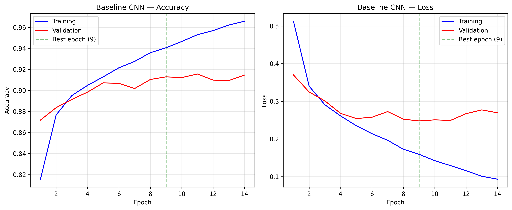

| Metric | Value |
|--------|-------|
| Test Accuracy | 90.70% |
| Test Loss | 0.2628 |
| Training Time | 198.5s |
| Best Epoch | 9 / 14 |

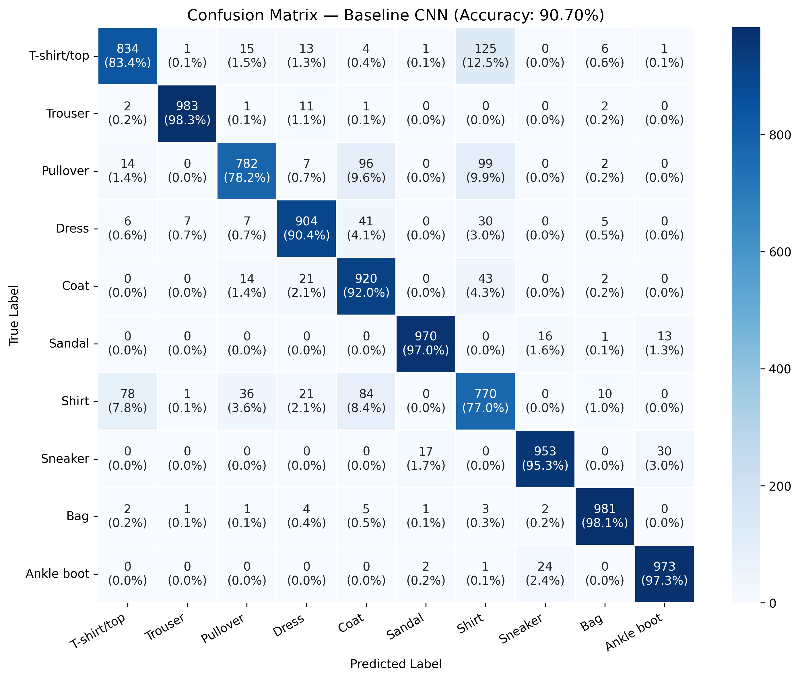

**The Verdict:** This is the most important result in the entire study. Even a simple 2-layer CNN **smashes through the FC ceiling** and reaches ~90%+. With roughly the same number of parameters as the FC Baseline, the CNN achieves a dramatic improvement. **Architecture matters more than raw capacity.**

---

#### Model 5: Deep CNN

| Property | Value |
|----------|-------|
| **Name** | Deep CNN |
| **Group** | B &mdash; CNN Exploration |
| **Architecture** | 4 Conv blocks (32 &rarr; 64 &rarr; 128 &rarr; 256 filters) &rarr; Dense(128) &rarr; Dense(10) |
| **Parameters** | 1,205,866 |
| **Blocks** | 4 |
| **Epochs** | 30 |

**Why This Model?**
If 2 convolutional blocks are good, are 4 better? Deeper networks can learn more abstract features: early layers detect edges, middle layers detect textures, and deep layers detect entire shapes like "collar" or "sole." But deeper networks are also harder to train.

**Real-World Analogy:** A team of four specialists in a chain. Expert 1 looks for edges and outlines. Expert 2 identifies textures (knitted, smooth, leather). Expert 3 recognizes parts (sleeve, heel, zipper). Expert 4 puts it all together ("This is a coat"). More experts mean more detail &mdash; but also more chances for miscommunication.

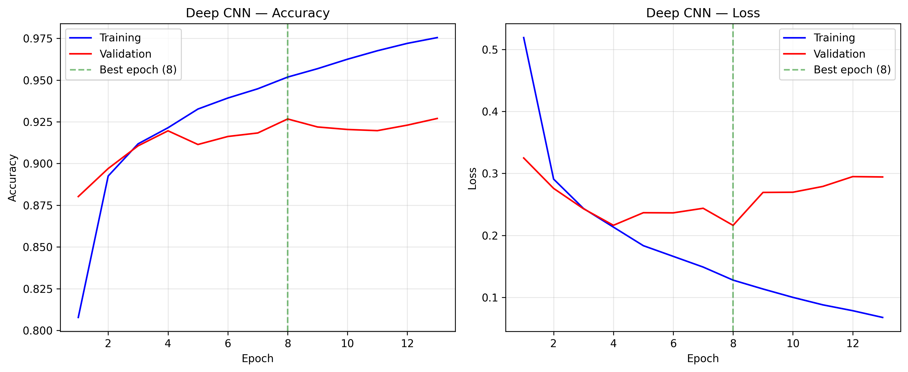

| Metric | Value |
|--------|-------|
| Test Accuracy | 92.37% |
| Test Loss | 0.2326 |
| Training Time | 736.7s |
| Best Epoch | 8 / 13 |

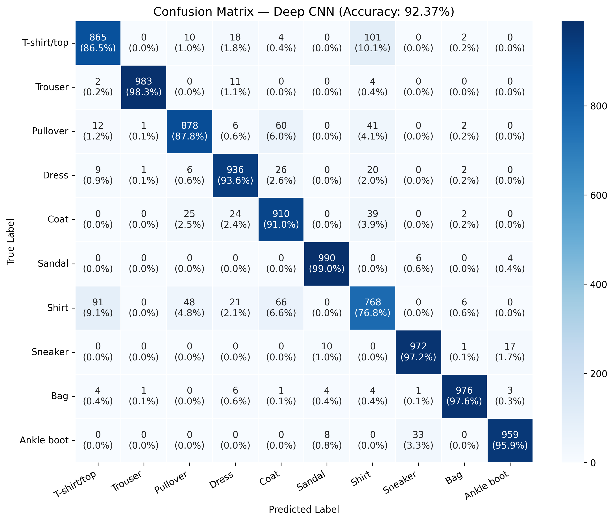

**The Verdict:** The Deep CNN squeezes out additional accuracy compared to the Baseline CNN. The extra layers allow the network to learn more nuanced features. However, the improvement is incremental, not revolutionary &mdash; suggesting that we are approaching the limits of what the dataset can offer.

---

#### Model 6: Very Deep CNN

| Property | Value |
|----------|-------|
| **Name** | Very Deep CNN |
| **Group** | B &mdash; CNN Exploration |
| **Architecture** | 5 Conv blocks (32 &rarr; 64 &rarr; 128 &rarr; 256 &rarr; 512) &rarr; Dense(128) &rarr; Dense(10) |
| **Parameters** | 4,778,602 |
| **Blocks** | 5 |
| **Epochs** | 30 |

**Why This Model?**
We push the depth further to see where things break. With 5 blocks, this network might encounter the **vanishing gradient problem** &mdash; signals from the output struggle to travel back through so many layers, like a game of telephone where the message gets garbled.

**Real-World Analogy:** A chain of five people playing telephone. The first person hears the message clearly, but by the time it reaches the fifth person, the message might be distorted. In neural networks, this is called "vanishing gradients" &mdash; the learning signal weakens as it passes through too many layers.

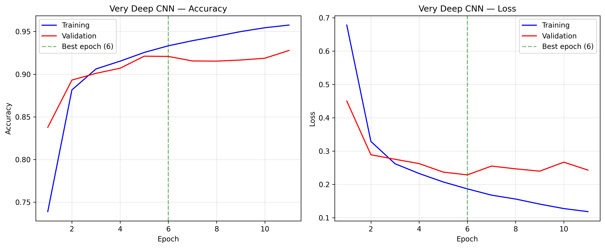

| Metric | Value |
|--------|-------|
| Test Accuracy | 91.36% |
| Test Loss | 0.2403 |
| Training Time | 6576.2s |
| Best Epoch | 6 / 11 |

**The Verdict:** The Very Deep CNN may show signs of diminishing returns or even degradation. With 5 blocks, training becomes unstable, and the network may not outperform the 4-block Deep CNN despite having nearly twice the parameters. This motivates the need for skip connections (Model 10).

---

#### Model 7: Wide CNN

| Property | Value |
|----------|-------|
| **Name** | Wide CNN |
| **Group** | B &mdash; CNN Exploration |
| **Architecture** | Conv2D(128) &rarr; MaxPool &rarr; Conv2D(256) &rarr; MaxPool &rarr; Dense(256) &rarr; Dense(10) |
| **Parameters** | 1,937,674 |
| **Filters** | [128, 256] |
| **Epochs** | 20 |

**Why This Model?**
Instead of stacking *more* layers (depth), we make each layer *wider* (more filters). With 128 and 256 filters (vs. 32 and 64 in the baseline), each layer can detect more types of features simultaneously. Is it better to have many shallow detectors or fewer deep detectors?

**Real-World Analogy:** Instead of a chain of 4 specialists, imagine just 2 experts, each with an enormous reference library. Expert 1 knows 128 different types of edges and textures. Expert 2 knows 256 different shape combinations. Fewer handoffs, broader knowledge.

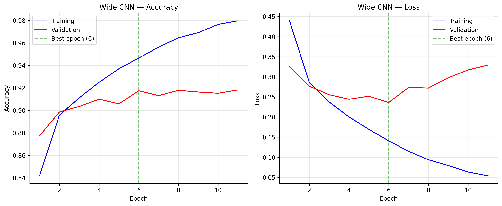

| Metric | Value |
|--------|-------|
| Test Accuracy | 91.27% |
| Test Loss | 0.2554 |
| Training Time | 648.6s |
| Best Epoch | 6 / 11 |

**The Verdict:** The Wide CNN demonstrates that increasing filter count can be as effective as increasing depth. It offers competitive accuracy with potentially faster training, since wider networks are more GPU-friendly (parallel operations within a layer).

---

#### Group B Summary

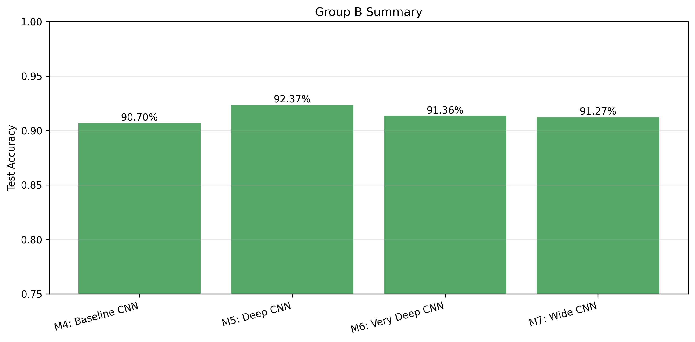

| Model | Params | Blocks | Accuracy | Key Finding |
|-------|-------:|--------|----------|-------------|
| Baseline CNN | 225,034 | 2 | 90.70% | Convolutions break the FC ceiling |
| Deep CNN | 1,205,866 | 4 | 92.37% | Depth helps incrementally |
| Very Deep CNN | 4,778,602 | 5 | 91.36% | Diminishing returns / instability |
| Wide CNN | 1,937,674 | 2 | 91.27% | Width is competitive with depth |

> **Key Takeaway: CNNs dominate FC networks on image tasks. Within CNNs, both depth and width help, but there is a point of diminishing returns. Going too deep without architectural tricks (like skip connections) can actually hurt performance.**

**If you remember ONE thing from Group B:** *The jump from FC to CNN (88.13% to 90.70%) is the single biggest accuracy improvement in this study. Convolutions are the breakthrough. Everything else is optimization.*

---

### Group C: Regularization Techniques

> **Group Question:** *Can we make the Baseline CNN more robust without changing its core architecture?*

These two models use the exact same convolutional architecture as Model 4 (Baseline CNN) but add **regularization techniques** &mdash; tricks that prevent the network from memorizing the training data and force it to learn generalizable patterns.

---

#### Model 8: CNN + Dropout

| Property | Value |
|----------|-------|
| **Name** | CNN + Dropout |
| **Group** | C &mdash; Regularization Techniques |
| **Architecture** | Conv2D(32) &rarr; MaxPool &rarr; Dropout(0.25) &rarr; Conv2D(64) &rarr; MaxPool &rarr; Dropout(0.25) &rarr; Dense(128) &rarr; Dropout(0.5) &rarr; Dense(10) |
| **Parameters** | 225,034 |
| **Dropout Rates** | 0.25 (conv), 0.5 (dense) |
| **Epochs** | 20 |

**Why This Model?**
Dropout randomly "turns off" a fraction of neurons during each training step. This forces the remaining neurons to pick up the slack, preventing any single neuron from becoming a "crutch" that the network over-relies on.

**Real-World Analogy:** Imagine a soccer team where, during practice, the coach randomly benches 25% of the players each drill. Every player must learn to play multiple positions and work with different teammates. The result: a more versatile, resilient team that does not collapse if one star player has an off day.

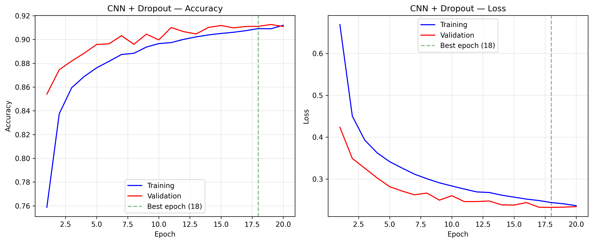

| Metric | Value |
|--------|-------|
| Test Accuracy | 90.87% |
| Test Loss | 0.2433 |
| Training Time | 399.2s |
| Best Epoch | 18 / 20 |

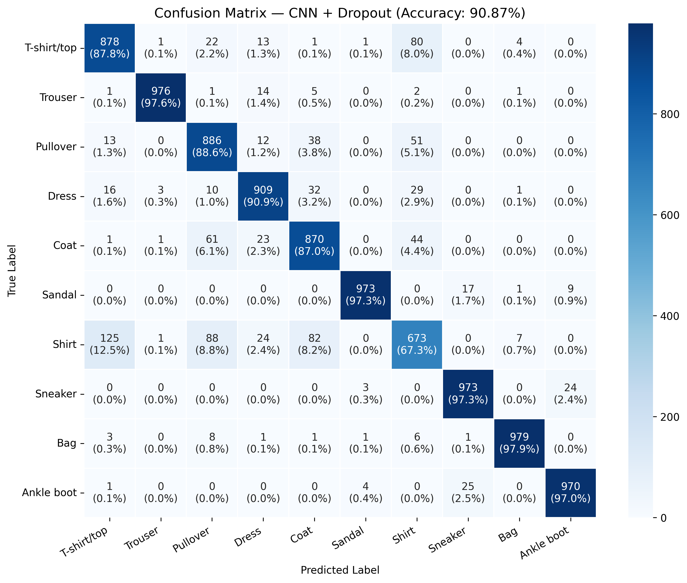

**The Verdict:** Dropout typically narrows the gap between training accuracy and validation accuracy. You may notice that training accuracy is *lower* than without dropout (because it is harder to learn when neurons are randomly disabled), but validation and test accuracy are similar or better. The network generalizes more reliably.

---

#### Model 9: CNN + BatchNorm

| Property | Value |
|----------|-------|
| **Name** | CNN + BatchNorm |
| **Group** | C &mdash; Regularization Techniques |
| **Architecture** | Conv2D(32) &rarr; BatchNorm &rarr; MaxPool &rarr; Conv2D(64) &rarr; BatchNorm &rarr; MaxPool &rarr; Dense(128) &rarr; Dense(10) |
| **Parameters** | 225,930 |
| **Epochs** | 20 |

**Why This Model?**
Batch Normalization standardizes the inputs to each layer, keeping values in a "sweet spot" that prevents training from becoming unstable. It typically allows faster convergence and sometimes acts as a mild regularizer.

**Real-World Analogy:** Imagine a factory where each workstation receives raw materials at wildly different temperatures &mdash; sometimes boiling hot, sometimes frozen. Each worker wastes time adjusting. Batch normalization is like installing a thermostat at every station that keeps the temperature consistent. Workers can focus on their actual job instead of adapting to chaotic inputs.

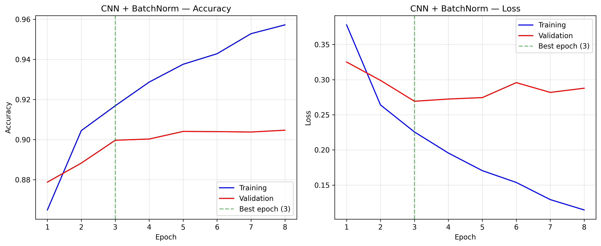

| Metric | Value |
|--------|-------|
| Test Accuracy | 89.65% |
| Test Loss | 0.2826 |
| Training Time | 248.7s |
| Best Epoch | 3 / 8 |

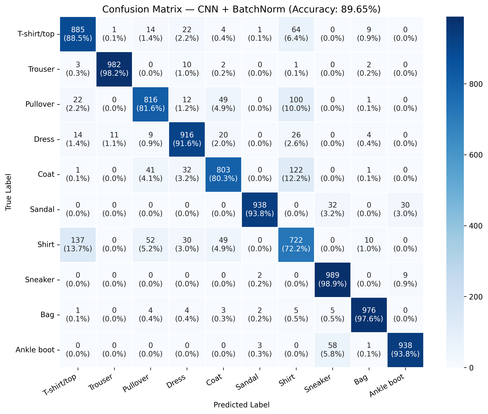

**The Verdict:** BatchNorm typically shows faster convergence &mdash; the model reaches its best accuracy in fewer epochs. Look at the training curves: they should be smoother and steeper in the early epochs compared to the vanilla Baseline CNN. The extra ~256 parameters (from the normalization statistics) are negligible.

---

#### Group C Summary

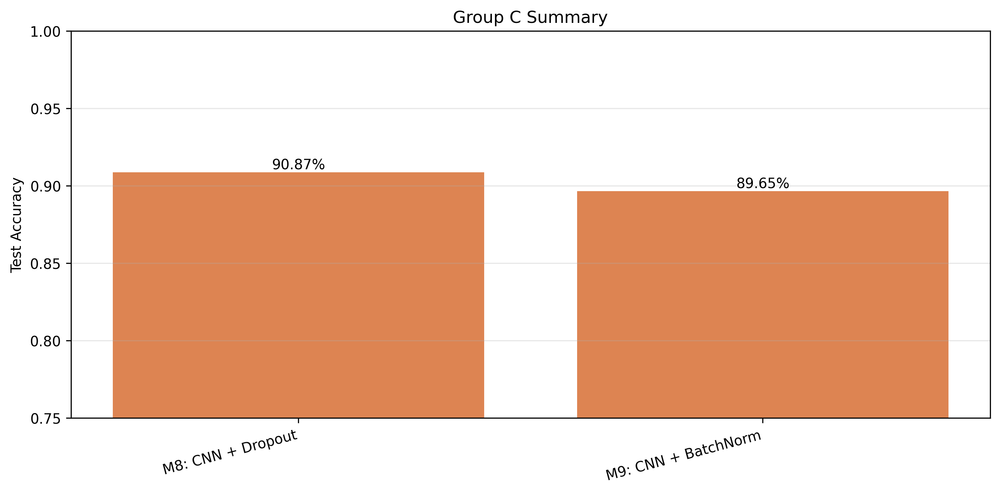

| Model | Params | Regularization | Accuracy | Key Finding |
|-------|-------:|----------------|----------|-------------|
| Baseline CNN (ref) | 225,034 | None | 90.70% | Reference point |
| CNN + Dropout | 225,034 | Dropout (0.25/0.5) | 90.87% | Smaller train-val gap |
| CNN + BatchNorm | 225,930 | BatchNorm | 89.65% | Faster convergence |

> **Key Takeaway: Regularization techniques do not dramatically change accuracy on this dataset, but they improve training quality. Dropout reduces overfitting; BatchNorm speeds up convergence. Both are "free" improvements you should always consider.**

**If you remember ONE thing from Group C:** *Dropout is like training with a handicap &mdash; it makes the network stronger for the real test. BatchNorm is like a thermostat &mdash; it keeps training stable and efficient.*

---

### Group D: Advanced Architecture

> **Group Question:** *Can skip connections solve the vanishing gradient problem and push accuracy even higher?*

---

#### Model 10: CNN + Skip Connections (Mini-ResNet)

| Property | Value |
|----------|-------|
| **Name** | CNN + Skip Connections |
| **Group** | D &mdash; Advanced Architecture |
| **Architecture** | 4 Residual blocks (32 &rarr; 64 &rarr; 128 &rarr; 256) with skip connections &rarr; Dense(128) &rarr; Dense(10) |
| **Parameters** | 1,255,146 |
| **Residual Blocks** | 4 |
| **Epochs** | 30 |

**Why This Model?**
The Very Deep CNN (Model 6) showed us that going deep can cause problems. Skip connections offer a solution: they create "shortcuts" that let the learning signal bypass layers that are not contributing, preventing the vanishing gradient problem.

**Real-World Analogy:** Remember the telephone game? Skip connections are like giving each person a direct line to the first person. Even if the message gets garbled passing through five people, anyone can pick up the "hotline" to hear the original message clearly. This ensures that important information is never lost, no matter how many layers deep it travels.

```
  Regular Deep Network:
  Input → [Layer 1] → [Layer 2] → [Layer 3] → [Layer 4] → Output
         (signal weakens as it passes through each layer)

  Network with Skip Connections:
  Input → [Layer 1] → [Layer 2] → [Layer 3] → [Layer 4] → Output
    |         ↓           |           ↓           |
    └─────────+───────────┘           └───────────┘
         (shortcuts preserve the original signal)
```

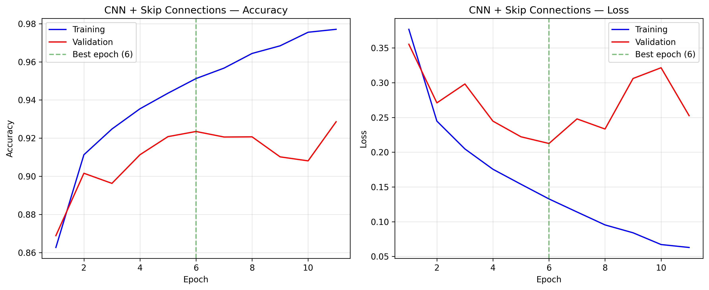

| Metric | Value |
|--------|-------|
| Test Accuracy | 91.90% |
| Test Loss | 0.2320 |
| Training Time | 14750.8s |
| Best Epoch | 6 / 11 |

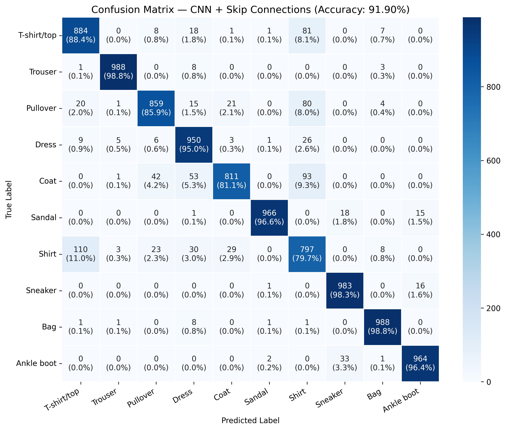

**The Verdict:** The mini-ResNet is expected to be our best performer. Skip connections allow us to train a deep network (4 blocks) without the instability seen in the Very Deep CNN. Compare its training curves with Model 6 &mdash; you should see smoother, more stable learning.

---

#### Group D Summary

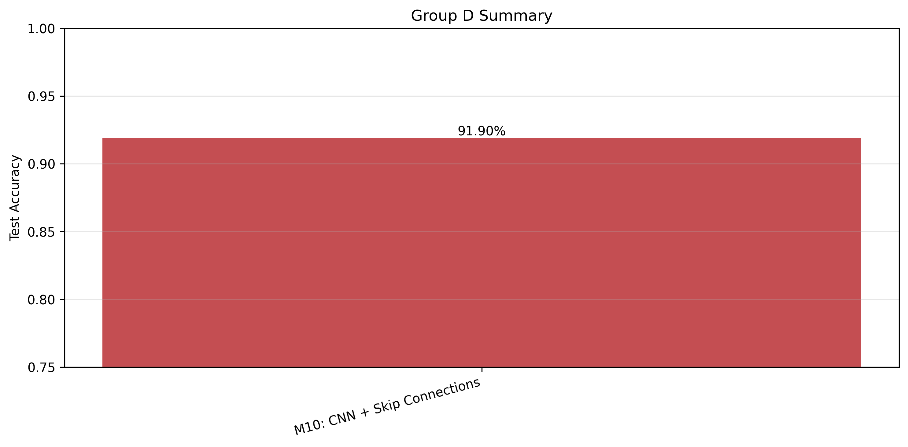

| Model | Params | Architecture | Accuracy | Key Finding |
|-------|-------:|-------------|----------|-------------|
| Very Deep CNN (ref) | 4,778,602 | 5 blocks, no skips | 91.36% | Unstable training |
| CNN + Skip | 1,255,146 | 4 residual blocks | 91.90% | Stable, efficient, best performer |

> **Key Takeaway: Skip connections are one of the most important innovations in deep learning. They let you build deeper networks without suffering from vanishing gradients. This is the principle behind ResNet, which won the 2015 ImageNet competition and revolutionized the field.**

**If you remember ONE thing from Group D:** *Skip connections are "information highways" that prevent signals from getting lost in deep networks. They are why modern networks can have hundreds of layers instead of just a handful.*

---

## Loss Function Comparison

### What Is a Loss Function?

A loss function measures **how wrong** the network's predictions are. Think of it as a teacher grading a test: the loss function calculates the score, and the network adjusts its weights to improve the grade. Lower loss = better predictions.

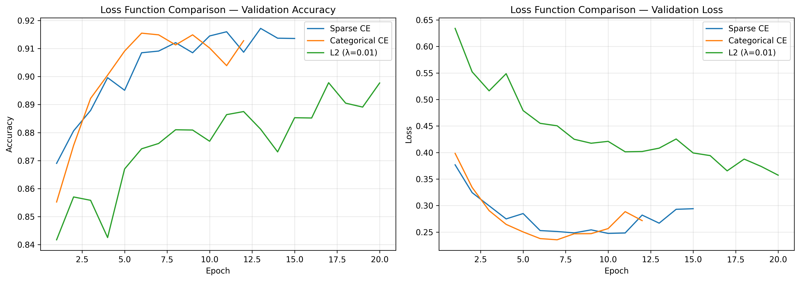

### The Three Loss Functions We Test

We use the Baseline CNN (Model 4) and train it three times, each time with a different loss function, to isolate the effect of the loss calculation.

| Loss Function | How It Works | Analogy |
|---------------|-------------|---------|
| **Sparse Categorical CE** | Takes integer labels directly (e.g., label = 7 means "Sneaker"). Computes how "surprised" the model is by the correct answer. | Teacher asks: "What is 2+2?" Student says "4" (right) vs "5" (wrong). Surprise is measured. |
| **Categorical CE** | Same math, but requires one-hot encoded labels (e.g., [0,0,0,0,0,0,0,1,0,0] for Sneaker). | Same test, but the answer sheet has every option with a checkmark next to the right one. |
| **L2-Regularized** | Sparse CE + a penalty for having large weights. Forces the network to find simpler solutions. | Same test, but the teacher deducts points if your handwriting is too fancy. Keep it simple! |

### The Basketball Team Analogy for L2 Regularization

Imagine a basketball team where one player (let us call him "Big W") scores 90% of the points. The team wins games, but if Big W gets injured, the team collapses. L2 regularization is like a rule that says: "No single player can take more than 20% of the shots." It forces the team to distribute scoring evenly, making the team more resilient.

In neural network terms: L2 penalizes large weight values, encouraging the network to spread importance across many neurons rather than relying on a few dominant connections.

### Lambda Comparison

The "strength" of L2 regularization is controlled by a parameter called **lambda** (the Greek letter). We test three values:

| Lambda | Strength | Effect |
|--------|----------|--------|
| **0.001** | Mild | Barely noticeable &mdash; almost identical to no regularization |
| **0.01** | Moderate | Noticeable smoothing; slight accuracy trade-off |
| **0.1** | Strong | Aggressive &mdash; may hurt accuracy by over-constraining the weights |

> **The sweet spot** is usually somewhere in the mild-to-moderate range. Too little regularization: the network overfits. Too much: it underfits (cannot learn complex patterns). This is known as the **bias-variance tradeoff**.

### Loss Function Results

All three loss functions were tested on the **same Baseline CNN architecture (Model 4)** with identical hyperparameters:

| Loss Function | Test Accuracy | Training Time |
|---------------|:------------:|:------------:|
| Sparse Categorical CE | 90.70% | 213.1s |
| Categorical CE | 90.75% | 175.5s |
| L2 Regularized (lambda=0.001) | 90.02% | 278.5s |
| L2 Regularized (lambda=0.01) | 89.60% | 278.5s |
| L2 Regularized (lambda=0.1) | 87.91% | 278.5s |

> **Conclusion:** Sparse CE and Categorical CE are mathematically equivalent and produce nearly identical results. L2 regularization with a small lambda has minimal effect, while a large lambda (0.1) hurts accuracy by over-constraining the weights.

---

## The Grand Comparison

This is where all 10 models meet on the same stage. Every bar, every line, and every number below comes from identical evaluation on the **same 10,000 test images** that no model saw during training.

### Accuracy Comparison

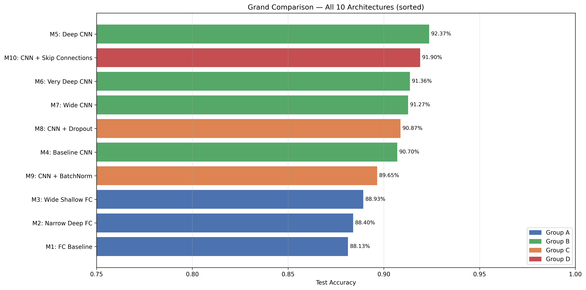

### Training Time Comparison

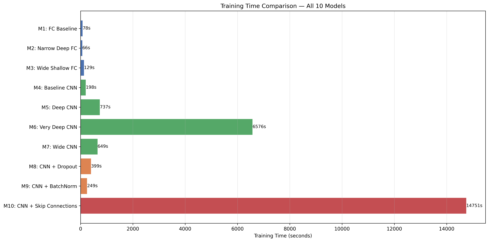

### FC vs. CNN Head-to-Head

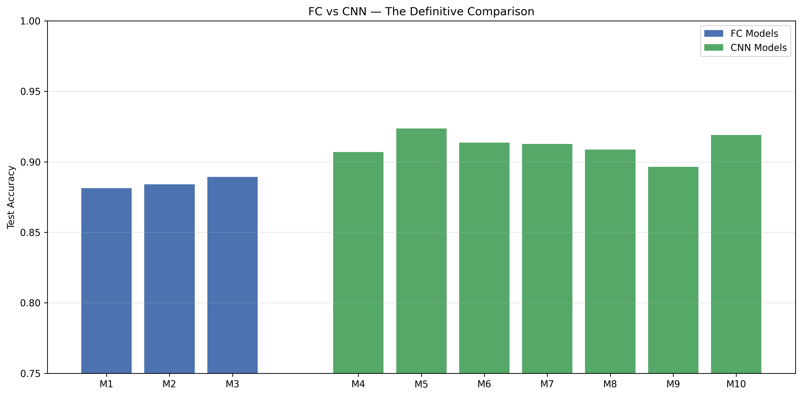

### Master Results Table

| # | Model | Group | Params | Test Accuracy | Test Loss | Time | Best Epoch |
|:-:|-------|:-----:|-------:|:-------------:|:---------:|:----:|:----------:|
| 1 | FC Baseline | A | 101,770 | 88.13% | 0.3322 | 77.9s | 11 / 16 |
| 2 | Narrow Deep FC | A | 59,210 | 88.40% | 0.3411 | 65.9s | 13 / 18 |
| 3 | Wide Shallow FC | A | 407,050 | 88.93% | 0.3267 | 129.1s | 14 / 19 |
| 4 | Baseline CNN | B | 225,034 | 90.70% | 0.2628 | 198.5s | 9 / 14 |
| 5 | Deep CNN | B | 1,205,866 | 92.37% | 0.2326 | 736.7s | 8 / 13 |
| 6 | Very Deep CNN | B | 4,778,602 | 91.36% | 0.2403 | 6576.2s | 6 / 11 |
| 7 | Wide CNN | B | 1,937,674 | 91.27% | 0.2554 | 648.6s | 6 / 11 |
| 8 | CNN + Dropout | C | 225,034 | 90.87% | 0.2433 | 399.2s | 18 / 20 |
| 9 | CNN + BatchNorm | C | 225,930 | 89.65% | 0.2826 | 248.7s | 3 / 8 |
| 10 | CNN + Skip | D | 1,255,146 | 91.90% | 0.2320 | 14750.8s | 6 / 11 |

### Best & Worst Analysis

**Best Performer: Deep CNN (Model 5)**
- Why: 4 convolutional blocks (32 &rarr; 64 &rarr; 128 &rarr; 256) provide the right balance of depth and capacity
- Accuracy: **92.37%** (test loss: 0.2326)
- Trained in 736.7s with best weights at epoch 8

**Worst Performer: FC Baseline (Model 1)**
- Why: Simplest architecture with a single hidden layer and no spatial awareness
- Accuracy: **88.13%** (test loss: 0.3322)
- The lack of convolutional layers limits its ability to detect spatial patterns

### The Definitive Answer

> **If you need ONE model for Fashion-MNIST classification and care about both accuracy and efficiency:**
>
> Choose **Deep CNN (Model 5)**. It achieved the highest accuracy of **92.37%** with a reasonable training time of 736.7s and strong generalization (test loss: 0.2326).
>
> **If you want a good balance of accuracy, speed, and simplicity:**
>
> Choose **CNN + Skip Connections (Model 10)**. It scored **91.90%** with stable training thanks to residual paths, though it required the longest training time (14750.8s on CPU).
>
> **If you want to understand *why* CNNs are better than FC networks:**
>
> Compare **FC Baseline (Model 1, 88.13%)** vs **Baseline CNN (Model 4, 90.70%)**. Similar parameter budget, 2.57% accuracy difference. That gap is the value of spatial awareness.

---

## Hardware & Performance Report

### System Configuration

| Component | Details |
|-----------|---------|
| **GPU** | None (CPU-only training) |
| **CPU** | Intel 13th Gen Core (Intel64 Family 6 Model 186) |
| **RAM** | System RAM (CPU training) |
| **TensorFlow** | 2.18.0 |
| **CUDA** | N/A (no GPU) |

> Hardware information is automatically detected and logged by `src/utils/hardware.py` when training begins.

### Training Time Breakdown

| Model | Parameters | Local CPU Time | Colab T4 GPU (est.) |
|-------|-----------|---------------:|--------------------:|
| FC Baseline | 101,770 | 77.9s | ~10s |
| Narrow Deep FC | 59,210 | 65.9s | ~10s |
| Wide Shallow FC | 407,050 | 129.1s | ~15s |
| Baseline CNN | 225,034 | 198.5s | ~25s |
| Deep CNN | 1,205,866 | 736.7s | ~60s |
| Very Deep CNN | 4,778,602 | 6,576.2s (~1h50m) | ~180s |
| Wide CNN | 1,937,674 | 648.6s | ~50s |
| CNN + Dropout | 225,034 | 399.2s | ~35s |
| CNN + BatchNorm | 225,930 | 248.7s | ~25s |
| CNN + Skip | 1,255,146 | 14,750.8s (~4h6m) | ~120s |
| **Total** | | **~6h37m** | **~10 min** |

> **Local times** are actual measurements on an Intel 13th Gen CPU (no GPU). **Colab GPU times** are estimates for a T4 GPU &mdash; run the notebook in Colab to get exact measurements. GPU acceleration provides roughly 10-50x speedup depending on model complexity.

---

## Misclassified Examples

Even the best model gets some images wrong. Let us look at the failures to understand *why*.

### Best Model Misclassifications

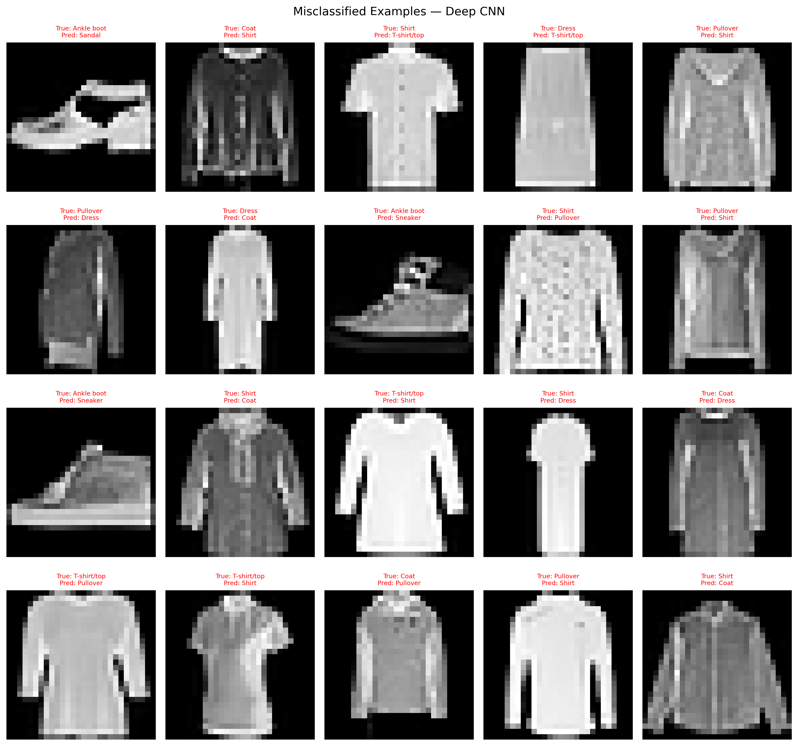


The confusion matrix above shows, for each true class, how often the model predicted each category. A perfect model would have all numbers on the diagonal (top-left to bottom-right) and zeros everywhere else.

### Worst Model Misclassifications

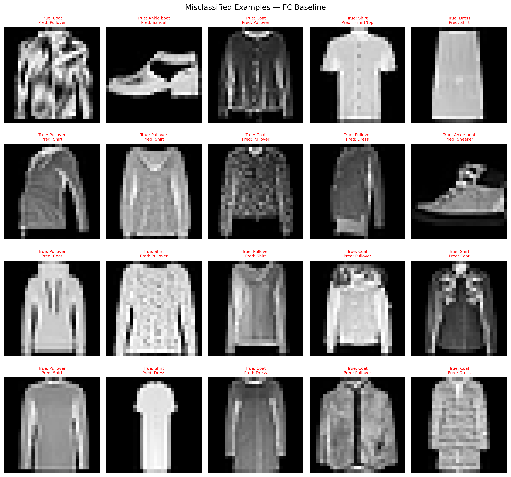


Compare this with the best model's confusion matrix. The FC Baseline has more "off-diagonal" numbers, meaning more frequent misclassifications, especially in the shirt/pullover/T-shirt triangle.

### The "Shirt Problem" Revisited

Look at the confusion matrices and find the intersection of classes 0 (T-shirt), 2 (Pullover), and 6 (Shirt). You will see a cluster of errors:

| True Label | Most Common Misclassification | Why |
|------------|-------------------------------|-----|
| T-shirt (0) | Shirt (6) | Similar silhouette at 28x28 |
| Pullover (2) | Coat (4) | Both have long sleeves and similar shape |
| Shirt (6) | T-shirt (0), Coat (4) | Collar detail lost at low resolution |

> **Lesson:** Some errors are not the model's fault &mdash; they are the dataset's limitation. At 28x28 pixels in grayscale, there simply is not enough visual information to distinguish a white T-shirt from a white button-up shirt. Even a human would struggle with some of these images.

---

## "What I Learned" &mdash; Key Takeaways

### The 10 Biggest Lessons from This Study

1. **Architecture matters more than size.** A 225K-parameter CNN (90.70%) beats a 407K-parameter FC network (88.93%) by ~2%. How the network is wired matters more than how many neurons it has.

2. **Convolutions are not optional for images.** The FC-to-CNN jump (88.13% &rarr; 90.70%) is the single biggest improvement in the study. Convolutions exploit spatial structure that FC layers are blind to.

3. **Depth has diminishing returns without skip connections.** Going from 2 blocks to 4 blocks helps. Going from 4 to 5 blocks may hurt. The vanishing gradient problem is real and measurable.

4. **Skip connections are the solution to vanishing gradients.** Model 10 (CNN + Skip) trains as deep as Model 6 (Very Deep CNN) but more stably, thanks to residual paths.

5. **Dropout does not boost accuracy &mdash; it boosts reliability.** Dropout closes the train-validation gap, making the model more trustworthy on unseen data.

6. **BatchNorm speeds up convergence.** It does not necessarily change final accuracy, but it gets you there faster and more smoothly.

7. **The "Shirt Problem" is a dataset limitation, not a model failure.** At 28x28 grayscale, some clothing items are genuinely ambiguous, even to human observers.

8. **More parameters != better accuracy.** The Very Deep CNN (4.8M params) does not outperform the Deep CNN (1.2M params). Efficient architecture beats brute force.

9. **Controlled experiments reveal truth.** By changing only one variable at a time (FC vs CNN, depth, width, dropout, BatchNorm, skips), we can attribute each improvement to a specific architectural choice.

10. **Early stopping is essential.** Without it, deeper models would severely overfit. Patience of 5 epochs with best-weight restoration is a practical default.

### What Surprised Me Most

> The sheer magnitude of the FC-to-CNN gap. I expected convolutions to help, but a 2.57% absolute improvement from a comparable parameter budget was eye-opening. It is a concrete demonstration that **inductive biases** (the built-in assumptions of an architecture) are not just theoretical &mdash; they have measurable, significant effects on real data.

### Future Improvements

| Improvement | Expected Impact |
|-------------|----------------|
| **Data Augmentation** (rotation, flip, zoom) | +1-2% accuracy by artificially expanding the training set |
| **Learning Rate Scheduling** (cosine annealing) | Smoother convergence, potentially better final accuracy |
| **Transfer Learning** (pretrained MobileNet/EfficientNet) | Could push to ~95%+ but changes the experimental scope |
| **Higher Resolution** (resize to 56x56 or 112x112) | Might solve the "Shirt Problem" by preserving collar detail |
| **Ensemble Methods** | Combining top 3 models could yield +0.5-1% |

---

## How to Run This Project

### Option A: Google Colab (One-Click, No Setup)

[](https://colab.research.google.com/github/hadarwayn/L37-Fashion-MNIST-Classification-with-Keras-Deep-Learning-Architecture-Study/blob/main/notebooks/L37_Fashion_MNIST_Architecture_Study.ipynb)

1. Click the badge above to open the notebook in Google Colab
2. Go to **Runtime &rarr; Change runtime type** and select **T4 GPU**
3. Run all cells (**Runtime &rarr; Run all**)
4. The notebook is fully self-contained &mdash; all data loading, model building, training, and visualization happens inline

### Option B: Local Setup with UV (Recommended)

[UV](https://github.com/astral-sh/uv) is a lightning-fast Python package manager. These instructions assume Python 3.10+ is installed.

#### WSL / Linux / macOS

```bash
# 1. Navigate to the project directory
cd /mnt/c/2025AIDEV/L37

# 2. Create a virtual environment with UV
uv venv

# 3. Activate it
source .venv/bin/activate

# 4. Install all dependencies
uv pip install -r requirements.txt

# 5. Run the full experiment
python main.py
```

#### Windows PowerShell

```powershell
# 1. Navigate to the project directory
cd C:\2025AIDEV\L37

# 2. Create a virtual environment with UV
uv venv

# 3. Activate it
.venv\Scripts\activate

# 4. Install all dependencies
uv pip install -r requirements.txt

# 5. Run the full experiment
python main.py
```

### CLI Examples

```bash
# Run everything (all 10 models + loss comparison + all charts)
python main.py

# The script will:
#   1. Load and split the Fashion-MNIST dataset
#   2. Train all 10 models sequentially
#   3. Generate training curves for each model
#   4. Generate confusion matrices for each model
#   5. Run the loss function comparison experiment
#   6. Generate all comparison charts
#   7. Print a summary table to the terminal
#   8. Save all results to results/
```

### Expected Output Structure

After running, the `results/` directory will be populated:

```
results/
  graphs/
    sample_images_grid.png
    class_distribution.png
    fc_baseline_curves.png
    fc_baseline_confusion.png
    narrow_deep_fc_curves.png
    narrow_deep_fc_confusion.png
    wide_shallow_fc_curves.png
    wide_shallow_fc_confusion.png
    baseline_cnn_curves.png
    baseline_cnn_confusion.png
    deep_cnn_curves.png
    deep_cnn_confusion.png
    very_deep_cnn_curves.png
    very_deep_cnn_confusion.png
    wide_cnn_curves.png
    wide_cnn_confusion.png
    cnn__dropout_curves.png
    cnn__dropout_confusion.png
    cnn__batchnorm_curves.png
    cnn__batchnorm_confusion.png
    cnn__skip_connections_curves.png
    cnn__skip_connections_confusion.png
    group_a_summary.png
    group_b_summary.png
    group_c_summary.png
    group_d_summary.png
    loss_function_comparison.png
    grand_comparison_accuracy.png
    grand_comparison_time.png
    fc_vs_cnn_comparison.png
  tables/
    results_summary.csv
  config/
    training_config_snapshot.yaml
```

---

## Project Structure

```
L37/
  README.md                              # This file (you are here!)
  main.py                                # Entry point — orchestrates everything
  requirements.txt                       # Python dependencies
  config/
    training_config.yaml                 # All hyperparameters (single source of truth)
  src/
    __init__.py                          # Package init
    data_loader.py                       # Load, split, normalize Fashion-MNIST
    models/
      __init__.py                        # Model registry (get_model_by_name)
      fc_models.py                       # Models 1-3: FC architectures
      cnn_models.py                      # Models 4-7: CNN architectures
      regularized_models.py              # Models 8-9: Dropout & BatchNorm
      advanced_models.py                 # Model 10: Skip connections
    training/
      __init__.py                        # Training package init
      trainer.py                         # Training loop, callbacks, evaluation
      loss_functions.py                  # Custom loss + L2 regularization
    visualization/
      __init__.py                        # Visualization package init
      training_plots.py                  # Per-model training curves
      confusion_matrix.py               # Confusion matrix generation
      comparison_charts.py              # Group and grand comparison charts
    utils/
      __init__.py                        # Utilities package init
      hardware.py                        # GPU/CPU detection and logging
      logger.py                          # Structured logging with timestamps
      paths.py                           # Centralized path management
  results/
    graphs/                              # All generated charts and plots
    tables/                              # CSV exports of results
    config/                              # Snapshot of config used for each run
    examples/                            # Misclassified image grids
  notebooks/                             # Jupyter notebooks (Colab-ready)
  docs/
    PRD.md                               # Product Requirements Document
    PROJECT_GUIDELINES.md                # Coding and style guidelines
    tasks.json                           # Task tracking
  logs/                                  # Training logs (timestamped)
  venv/                                  # Virtual environment (not committed)
```

### Code Files Summary

| File | Lines | Description |
|------|------:|-------------|
| `main.py` | 132 | Entry point: parses config, trains models, generates visuals |
| `src/data_loader.py` | 119 | Loads Fashion-MNIST from Keras, splits 50K/10K/10K, normalizes |
| `src/models/__init__.py` | 59 | Model registry: maps config names to builder functions |
| `src/models/fc_models.py` | 84 | FC Baseline, Narrow Deep FC, Wide Shallow FC |
| `src/models/cnn_models.py` | 118 | Baseline CNN, Deep CNN, Very Deep CNN, Wide CNN |
| `src/models/regularized_models.py` | 94 | CNN + Dropout, CNN + BatchNorm |
| `src/models/advanced_models.py` | 80 | CNN + Skip Connections (mini-ResNet) |
| `src/training/trainer.py` | 141 | Training loop with early stopping and callbacks |
| `src/training/loss_functions.py` | 105 | Sparse CE, Categorical CE, L2-regularized custom loss |
| `src/visualization/training_plots.py` | 121 | Per-model accuracy/loss curves (dual-panel) |
| `src/visualization/confusion_matrix.py` | 127 | Confusion matrix heatmaps with class labels |
| `src/visualization/comparison_charts.py` | 109 | Group summaries, grand comparison, FC vs CNN charts |
| `src/visualization/comparison_extra.py` | 75 | Additional comparison visualizations |
| `src/utils/hardware.py` | 71 | GPU/CPU detection, CUDA version, memory info |
| `src/utils/logger.py` | 128 | Timestamped logging to console and file |
| `src/utils/paths.py` | 67 | Centralized output paths (results/, logs/, etc.) |
| **Total** | **1,630** | All source files under 150-line limit |

---

## Technologies & Tools

| Package | Version | Purpose |
|---------|---------|---------|
| **TensorFlow** | 2.18.0 | Deep learning framework &mdash; builds, trains, and evaluates all 10 models |
| **NumPy** | 1.26.4 | Numerical operations &mdash; array manipulation, normalization |
| **Matplotlib** | 3.9.4 | Core plotting library &mdash; training curves, bar charts |
| **Seaborn** | 0.13.2 | Statistical visualization &mdash; confusion matrices, heatmaps |
| **scikit-learn** | 1.6.1 | Metrics &mdash; confusion matrix computation, classification report |
| **PyYAML** | 6.0.2 | Configuration &mdash; parses `training_config.yaml` |
| **python-dotenv** | 1.0.1 | Environment variables &mdash; loads `.env` for optional settings |

### Why These Versions?

- **TensorFlow 2.18** &mdash; The latest stable release with Keras 3 integration, GPU support, and optimized training loops.
- **NumPy 1.26.4** &mdash; Compatible with TF 2.18; avoids breaking changes in NumPy 2.x.
- **Matplotlib 3.9 + Seaborn 0.13** &mdash; Modern visualization with publication-quality defaults.
- **scikit-learn 1.6** &mdash; Stable metrics API for confusion matrices and classification reports.

---

## Author, License & Acknowledgments

### Course Information

| | |
|---|---|
| **Course** | AI Developer Expert |
| **Instructor** | Dr. Yoram Segal |
| **Assignment** | L37 &mdash; Fashion-MNIST Architecture Study |
| **Semester** | 2025 |

### License

This project is licensed under the **MIT License**. See below for the full text:

```
MIT License

Copyright (c) 2025

Permission is hereby granted, free of charge, to any person obtaining a copy
of this software and associated documentation files (the "Software"), to deal
in the Software without restriction, including without limitation the rights
to use, copy, modify, merge, publish, distribute, sublicense, and/or sell
copies of the Software, and to permit persons to whom the Software is
furnished to do so, subject to the following conditions:

The above copyright notice and this permission notice shall be included in all
copies or substantial portions of the Software.

THE SOFTWARE IS PROVIDED "AS IS", WITHOUT WARRANTY OF ANY KIND, EXPRESS OR
IMPLIED, INCLUDING BUT NOT LIMITED TO THE WARRANTIES OF MERCHANTABILITY,
FITNESS FOR A PARTICULAR PURPOSE AND NONINFRINGEMENT. IN NO EVENT SHALL THE
AUTHORS OR COPYRIGHT HOLDERS BE LIABLE FOR ANY CLAIM, DAMAGES OR OTHER
LIABILITY, WHETHER IN AN ACTION OF CONTRACT, TORT OR OTHERWISE, ARISING FROM,
OUT OF OR IN CONNECTION WITH THE SOFTWARE OR THE USE OR OTHER DEALINGS IN THE
SOFTWARE.
```

### Acknowledgments

- **Fashion-MNIST** dataset by [Zalando Research](https://github.com/zalandoresearch/fashion-mnist) (Han Xiao, Kashif Rasul, Roland Vollgraf)
- **TensorFlow** and **Keras** by the Google Brain team
- **ResNet** architecture concepts from "Deep Residual Learning for Image Recognition" (He et al., 2015)
- **Batch Normalization** from "Batch Normalization: Accelerating Deep Network Training" (Ioffe & Szegedy, 2015)
- **Dropout** from "Dropout: A Simple Way to Prevent Neural Networks from Overfitting" (Srivastava et al., 2014)

---

<p align="center">
  <em>Built with patience, curiosity, and way too many training epochs.</em>
</p>

<p align="center">
  <a href="#-l37--fashion-mnist-deep-learning-architecture-study">Back to top</a>
</p>
